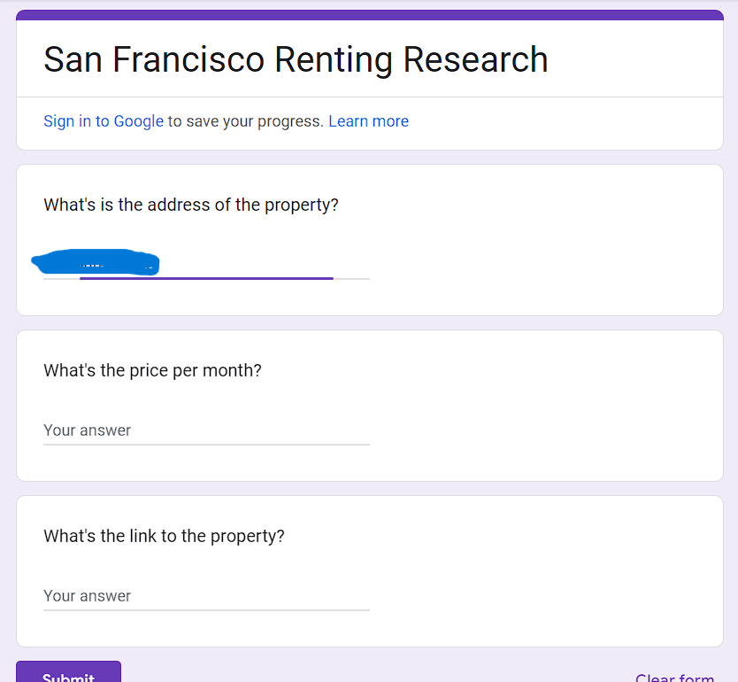
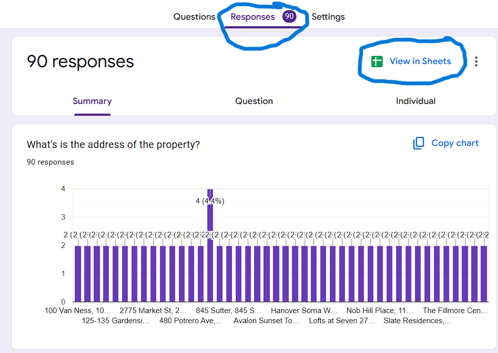
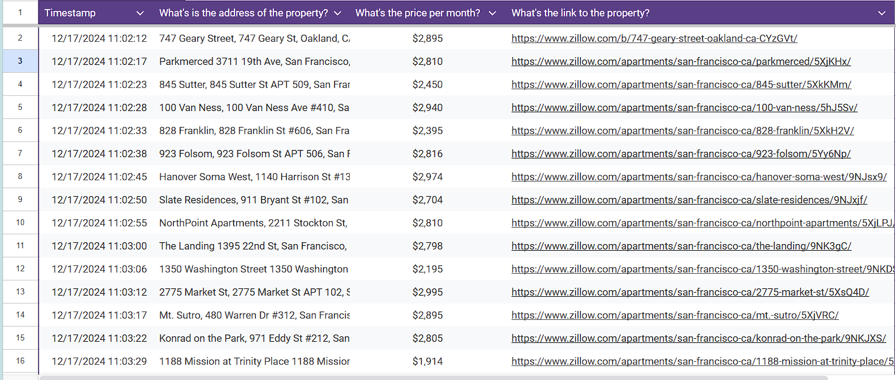

# Data Entry Automation
This project automates data entry using Python, BeautifulSoup and Selenium.
It Scrapes a clone website of Zillow for apartments available on rent in San Francisco and enters data into a Google form.
From which you can create a spreadsheet of your data.

**Prerequisite**
- Python 3.13
- BeatuifulSoup
- Selenium
- Google Chrome

**Steps to run the project**
1. Install python 3.13
2. Install module BeautifulSoup, Selenium and requests.
3. Create a Google form with 3 short answer questions as given in the picture below.
   
4. Copy the link of your Google form and paste it at line 9 of main.py
5. Run main.py
6. It will open Google form and start filling the scraped data.
7. Now open docs.google.com and select forms from the left sidebar.
8. Select your created form.
9. Click on the "Responses" tab and then "View in Sheets".
    
10. Your spreadsheet will be created.
    

### Created by AQIB ALI